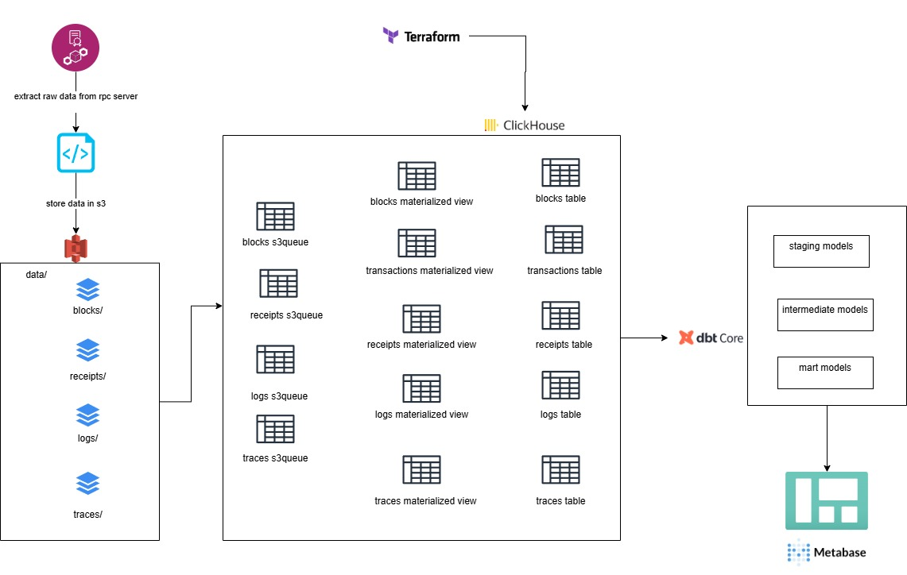

## Sonic blockchain Data indexer

This repository contains the extraction code for my end to end sonic blockchain analytics pipeline. The end to end pipeline involves extracting data from a self hosted rpc archival node server into an s3 storage bucket serving as a data lake and then loading the raw data into clickhouse for analytics using clickhouse s3queue engine.

Node setup - [Sonic node setup](https://github.com/geewynn/archive-rpc-nodes-setup/blob/main/sonic-chain/docs.md)

Clickhouse setup - [Clickhouse setup](https://github.com/geewynn/clickhouse-single-node-deployment)

Data Modelling - [DBT model](https://github.com/geewynn/chain_dbt_models)

## Overview
Sonic indexer is a standalone Python3 asynchronous service that extracts raw on‑chain data (blocks, receipts, logs, traces) from an JSON‑RPC provider and persists it directly to cloud object storage in Parquet format. The design optimises for fault‑tolerance, high throughput, and operational simplicity when deployed as a single container.

### Architecture


Project directory

```
.
├── main.py                 # orchestrator (4 pipelines)
├── extractor/
│   ├── blocks.py           # process_block(...)
│   ├── receipts.py         # process_receipt(...)
│   ├── logs.py             # process_logs(...)
│   └── traces.py           # process_traces(...)
├── rpc.py                  # fully async JSON-RPC helpers
├── store/
│   ├── parquet_writer.py   # write_batch_to_parquet(list, folder, ...)->Path
│   └── storage.py          # upload_to_storage(path, key)
├── settings.py             # constants loaded from .env (see §4)
└── docker-compose.yml      # production run

```

This Extraction script extracts Sonic chain data for a locally hosted archive node from the following JSON-RPC Endpoints

Blocks - `eth_getBlockByNumber`

Receipts - `eth_getBlockReceipts`

Logs - `eth_getLogs`

Traces - `trace_filter`

## Instructions to Run

## Prerequisites
- **Python 3.10+**
- [**uv**](https://github.com/astral-sh/uv)– fast package manager & runner
    ```
    pip install --upgrade uv
    ```

- I am running my own local sonic chain node. This can also be used with any Sonic chain JSON‑RPC archive node (Infura+, Alchemy+, Erigon, Nethermind).

## Clone & Install

```
git clone https://github.com/geewynn/sonic-blockchain-data-indexer.git
cd sonic-indexer


uv venv .venv

# Install lock‑file deps (pyproject.toml + uv.lock)
uv pip install -r uv.lock
```

## Configure

```
cp .env.example .env        # edit RPC_URL, OUTPUT_DIR, …
mkdir -p sonic_data         # staging dir for Parquet
mkdir -p checkpoints_files  # per‑extractor checkpoints
mkdir -p logs               # application log files
```

### Key Environment Variables

| Var                | Description                           | Example                  |
| ------------------ | ------------------------------------- | ------------------------ |
| `RPC_URL`          | HTTPS endpoint of archive node        | `https://endpoint/<key>` |
| `END_BLOCK`        | Absolute block height to stop at      | `22105397`               |
| `BATCH_BLOCKS`     | Blocks per Parquet file               | `5000`                   |
| `MICRO_BATCH_SIZE` | Blocks per RPC window for logs/traces | `20`                     |
| `CHECKPOINT_DIR`   | Folder for `blocks.json`, etc.        | `/app/checkpoints_files` |
| `LOG_DIR`          | Folder for rotated log files          | `/app/logs`              |

Full list documented in **DESIGN_DOCUMENT.md**.

## Run Locally

```
uv run main.py
```

Watch `logs/crawler.log` or the console for progress.

## Docker / Compose

```
docker compose build    # builds image from Dockerfile
docker compose up -d   # starts sonic_indexer service
```

Volumes created:

- `./sonic_data/` – staged Parquet files before upload
- `./checkpoints_files/` – individual JSON checkpoints
- `./logs/` – application logs (rotated)

Stop / update without data loss:

```
docker compose stop
# edit code / pull new image
docker compose up -d --build
```

## Key Components

`main.py`

Orchestrates four independent extractor pipelines (blocks, receipts, logs, traces).  Handles batching, error‑retries, adaptive windows and checkpoint persistence.

`Extractor modules (extractor/*.py)`

Contain RPC‑wrapper logic (process_block, process_logs, …) but no storage code – separation of concerns.

`rpc.py`

Thin async wrappers around the JSON‑RPC calls using uvloop + httpx.AsyncClient for maximal throughput.

`store/parquet_writer.py`

Converts Python lists of dicts to Arrow Table → Parquet file; returns local path.

`store/storage.py`

Uploads file to object storage and optionally deletes local copy.

`Checkpoint subsystem`

Each pipeline writes an atomic JSON file (checkpoints_files/<name>.json) containing the last block persisted, ensuring idempotent restarts.

`Logging`

Python logging with RotatingFileHandler (defaults 50 MB × 2). Logs are volume‑mounted for host visibility.


## Troubleshooting

|                             |                                                  |
| --------------------------- | ------------------------------------------------ |
| Symptom                     | Fix                                              |
| "response too large" errors | lower `MICRO_BATCH_SIZE` (e.g. 10)               |
| Memory spike                | lower `MICRO_BATCH_SIZE` _and/or_ `BATCH_BLOCKS` |
| Duplicate ranges            | ensure checkpoint files are mounted & writable   |
